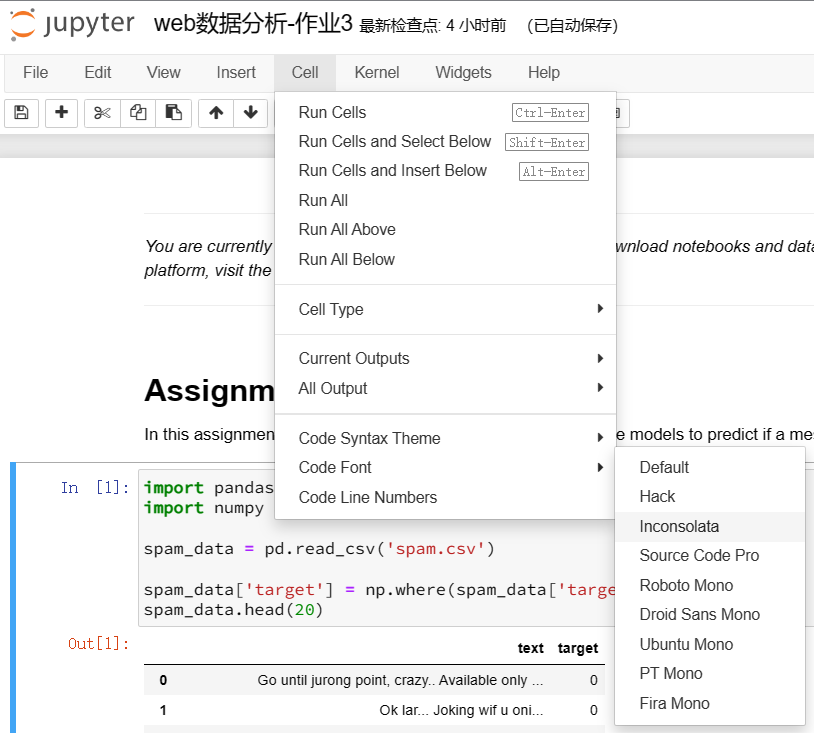

# `Anaconda`安装与配置

1. 下载[Anaconda](https://www.anaconda.com/download/)，本例安装路径为`D:\Anaconda3`

2. 修改环境变量：Path中添加`D:\Anaconda3`和`D:\Anaconda3\Scripts`

3. 修改环境目录：打开`C:\Users\XQ\.condarc`，添加以下代码：

   ```
   envs_dirs:
     - D:\Anaconda3\envs
   ```

4. 创建虚拟环境（需要管理员权限）：

   ```
   $ conda create -n 环境名 python=几.几几
   ```

5. 检验虚拟环境是否创建完毕：

   ```
   $ conda env list
   ```

6. 跳转到其他环境：

   ```
   $ conda activate 环境名
   ```

7. 删除环境：

   ```
   $ conda env remove --name 环境名
   ```

8. 安装包（需要管理员权限）：

   ```
   $ conda install 包名
   ```

9. 查看已安装的包：

   ```
   $ conda list
   ```

10. 在`Pycharm`中配置环境：`D:\Anaconda3\Scripts\conda.exe`

11. 修改默认打开的环境：

    `D:\Anaconda3\Scripts\activate.bat`

    ```
    修改为@CALL "%~dp0..\condabin\conda.bat" activate 环境名
    ```

# `Jupyter Notebook`配置

1. 安装`Jupyter Notebook`：

   ```
   $ conda install jupyter
   ```

2. 修改默认文件位置：

   1. 打开`C:\Users\XQ\.jupyter\jupyter_notebook_config.py`

   2. ```
      将# c.NotebookApp.notebook_dir = ''
      替换为c.NotebookApp.notebook_dir = '你想要的位置'（本例为c.NotebookApp.notebook_dir = F:/Code/Juypyter Notebook'）
      ```

   3. 验证：

   ```
   $ jupyter notebook
   ```
   出现`Serving notebooks from local directory: F:/Code/Juypyter Notebook`即修改完成

3. 个性化主题:

   1. 在`C:\Users\XQ\AppData\Roaming\jupyter`目录下创建目录`nbextensions\jupyter_themes`

   2. ```
      $ jupyter nbextension enable jupyter_themes/theme_selector
      ```

   3. 

4. 使用`R kernel`：

   1. 在`Anaconda Prompt`页面，进入`R.exe`所在目录（如`D:\R\R-4.3.0\bin`）

   2. ```
      $ R
      ```

   3. ```
      $ install.packages('IRkernel')
      ```

      在弹出的窗口中选择镜像

   4. ```
      IRkernel::installspec()
      ```

   5. 运行`Jupyter Notebook`，即可选择`R`内核

      

   # Tips

   1. 安装`sklearn`：

      ```
      $ conda install scikit-learn
      ```

   2. 
