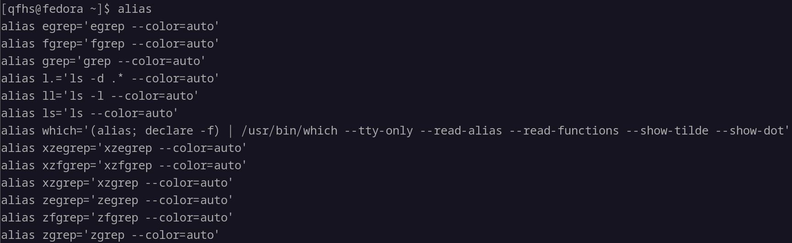
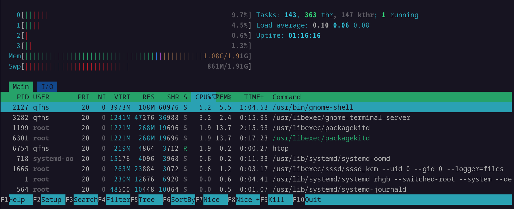
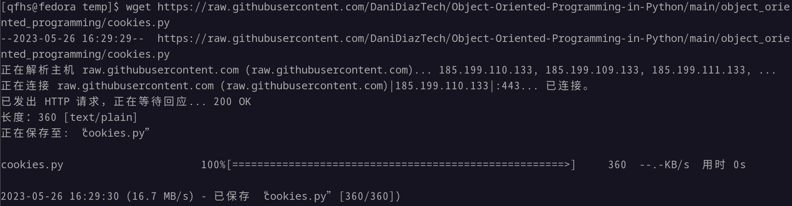

# Linux 基础命令学习

*参考：[40个最常用的Linux命令行大全 - 知乎](https://zhuanlan.zhihu.com/p/420247468)*

**注：Windows 环境安装 Linux 教程见 <VMWare + Fedora 安装 Linux>**

基础配置：

右上角：

1. `ls`：列出当前目录的内容

   1. `ls --color=auto`：着色的`ls`命令的输出

      

2. `alias`：在 shell 会话中定义临时别名

   1. `alias NAME="VALUE"`：定义一个临时别名

      `alias ls="ls --color=auto"`：本临时会话中后续的`ls`都着色

      

   2. `alias`：查看所有别名

      

   3. `unalias ls`：删除所有别名

3. `pwd`：打印当前工作目录

   

4. `cd`：更改目录

   `cd`有一些非常方便的简写：

   1. `cd`：进入home文件夹
   2. `cd ..`：向上移动一个级别
   3. `cd -`：返回上一个目录

   展示如下：

   

5. `cp`：复制文件和文件夹

   1. `cp 源文件 目标文件`：复制源文件到目标文件
   2. `cp -r 源目录/ 目标目录/`：使用递归标志复制整个目录，**注意：目录必须以“/”结尾**

6. `rm`：删除文件和目录

   1. `rm 目标文件`：删除常规文件
   2. `rm -r 目标目录/`：使用递归标志删除**空**目录
   3. `rm -rf 目标目录/`：使用递归标志删除**包含内容**的目录，**此命令非常危险！将会在没有任何提示的情况下抹去整个目录！请谨慎使用！**

7. `mv`：移动或重命名文件和目录

   1. `mv 源文件 目标目录/`：移动文件到目录
   2. `mv 原文件 新文件`：重命名文件

8. `mkdir`：在 shell 中创建文件夹

   1. `mkdir 文件夹名/`：在当前目录下创建文件夹
   2. `mkdir -p 文件夹名/子文件夹名/`：在当前目录下创建文件夹及其子文件夹

9. `man`：显示用户手册

   1. `man 某命令`：显示指定命令的手册

      `man mkdir`的部分结果截图：

      

10. `touch`：新建文件或者更新文件的访问和修改时间

    1. `touch 文件名`：在当前目录下新建文件

          

    2. `touch -m 文件名`：更新文件的访问和修改时间

11. `chmod`：更改权限

    `chmod 权限模式 文件或目录`，只有文件拥有者或者超级管理（root）才可以修改权限。

    权限模式：

    权限由三个主要的角色组成：所有者（Owner）、所属组（Group）和其他用户（Others）。每个角色都可以具有读取（Read）、写入（Write）和执行（Execute）权限。

    1. 数字表示法：

       | 权限名 | 数字表示 |
       | ------ | -------- |
       | 读取   | 4        |
       | 写入   | 2        |
       | 执行   | 1        |

    2. 符号表示法：

       | 权限名   | 数字表示 |
       | -------- | -------- |
       | 所有者   | u        |
       | 所属组   | g        |
       | 其他用户 | o        |
       | 所有角色 | a        |
       | 添加权限 | +        |
       | 删除权限 | -        |

    举例：

    - `chmod 644 文件名`：所有者具有读取和写入权限 (6)，所属组具有读取权限 (4)，其他用户具有读取权限 (4)
    - `chmod u+rwx 目录名`：给指定目录的所有者（user）添加读取、写入和执行权限

12. `exit`：结束shell会话，关闭正在使用的终端

13. `sudo `：升级为超级用户，通常用于安装软件或编辑用户主目录以外的文件。

14. `shutdown`：停止和重新启动机器电源

    1. `shutdown now`：立即关闭电源
    2. `shutdown hh:mm`：在指定时间关闭电源（24小时制）
    3. `shutdown -c`：取消以前的`shutdown`调用

15. `unzip`：从终端提取 .zip 文件的内容，需要用 package 管理器手动安装

    `unzip 压缩包名.zip`

16. `apt`, `yum`, `pacman`, `dnf `：访问 package 管理器，根据发行商选择

    `sudo dnf install 软件名`：适用于 Fedora 的安装命令（ sudo 用于获取超级用户权限）

    

17. `echo`：类似于 print()

    1. `echo "字符串"`：输出字符串

       

    2. `echo "$变量名"`：打印环境变量

       

18. `vim`：文本编辑器

    1. `vim`：进入vim界面，初次使用需要下载安装

       

    2. `vim 文件名`：编辑文件，如没有则创建

    常用的Vim命令：

    1. `i`：进入插入模式，可以开始编辑文件
    2. `Esc`：退出插入模式，回到命令模式
    3. `:wq`：命令模式下，保存文件并退出 Vim
    4. `:q!`：命令模式下，不保存文件，强制退出 Vim

19. `cat`：预览文件

    `cat 文件名`

    

20. `ps`：查看当前shell会话正在运行的进程

    

21. `htop`：交互式流程查看器（需要用 package 包管理器安装）

    

    键入`q`退出

22. `kill`：关闭程序

    使用`kill 程序名`或`kill PID`关闭指定程序

23. `ping`：测试网络连接

24. `history`：过去使用过的命令的枚举列表

    

25. `passwd`：更改用户帐户的密码，输入当前密码，然后输入新密码并确认

26. `which`：输出 shell 命令的完整路径

    `which 命令名`

27. `shred`：覆盖文件的内容，防止恢复

    1. `shred 文件名`
    2. `shred [选项] 文件名`：
       - `-u`：安全删除文件
       - `-n 次数`：指定覆盖次数
       - `-r`：用于目录

28. `less`：按页浏览文本文件，支持搜索和其他交互操作

    `less 文件名`

    

    

    键入`q`退出

29. `tail`：输出文件最后几行

    1. `tail 文件名`：输出文件最后 10 行
    2. `tail -n 几行 文件名`：指定行数

30. `head`：输出文件前几行

    1. `head 文件名`：输出文件前 10 行
    2. `head -n 几行 文件名`：指定行数

31. `grep`：使用正则表达式在文本文件中检索

    1. `grep "字符串" 文件名`
    2. `grep -i "字符串" 文件名`：忽略大小写
    3. `grep -n "字符串" 文件名`：显示匹配行及其行号
    4. `grep "字符串" 文件名1 文件名2 文件名3`：在多个文件中检索
    5. `grep -r "字符串" 目录名`：递归地在目录中检索
    6. `grep -E "正则表达式" 文件名`：使用正则表达式

    

32. `wc`：字数统计

    1. `wc 文件名`：输出“行数 字数 字节数 文件名”

       

    2. `wc -w 文件名`：只输出字数

       

33. `whoami`：显示当前用户名，效果等同`echo $USER`

    

34. `whatis`：打印命令的单行说明

    `whatis 命令名`

    

35. `uname`：打印系统信息

    

36. `find`：根据 regex 表达式在目录层次结构中搜索文件

    `find [标识符] [路径] -name [文件名]`

37. `wget`：从互联网检索内容

    